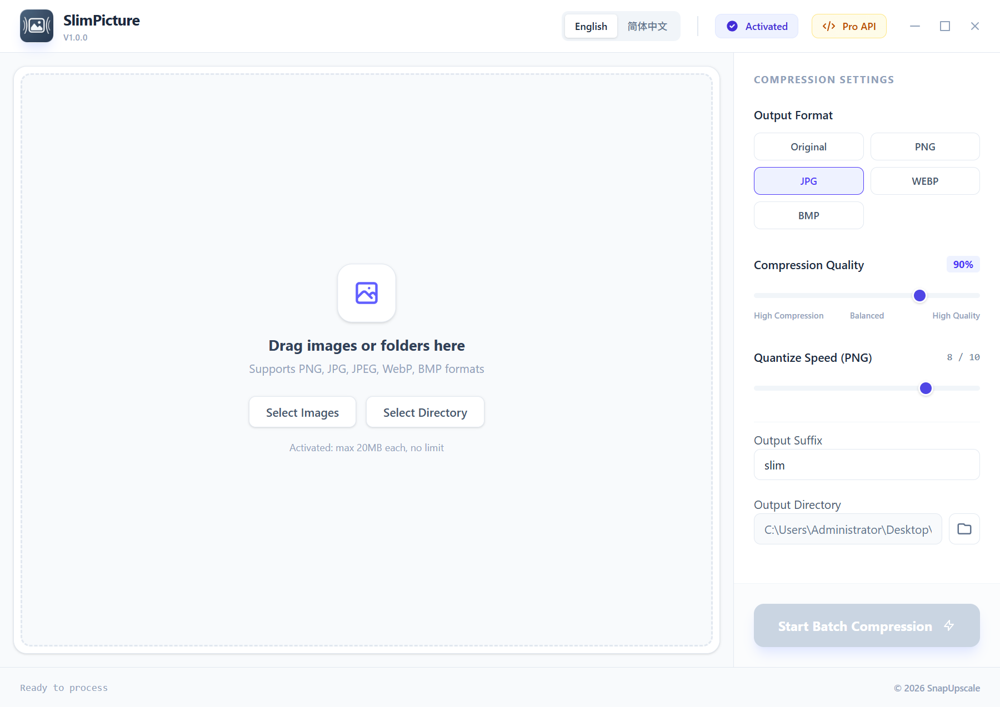
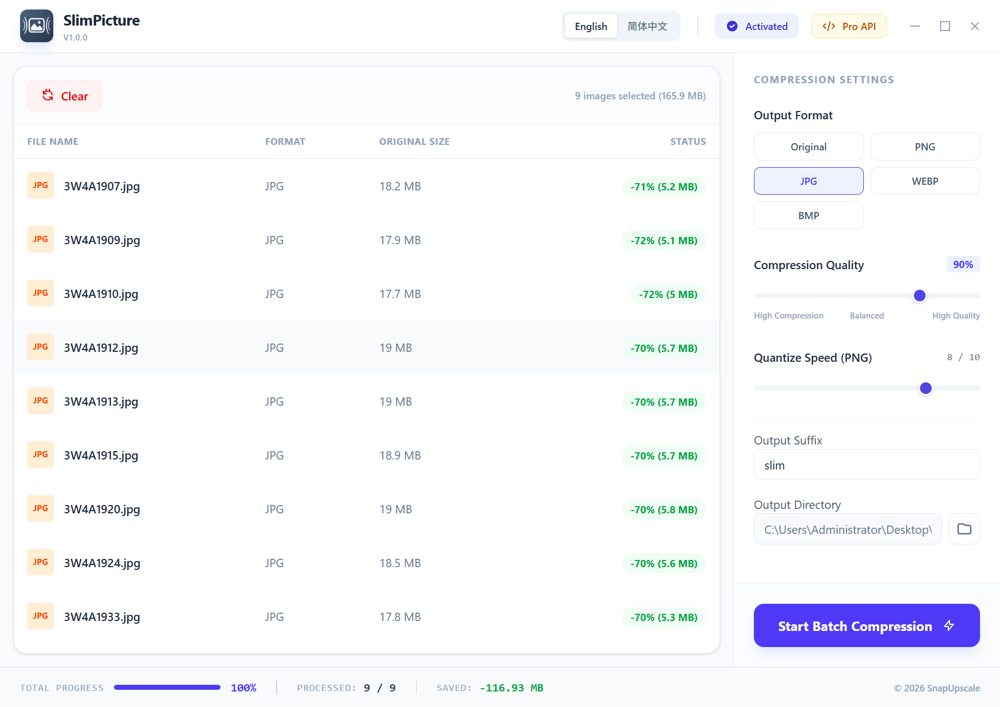
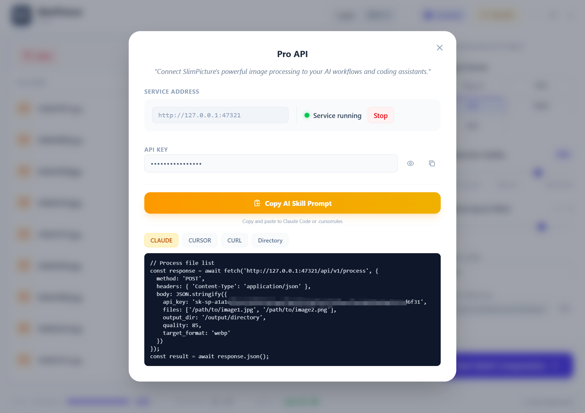

# SlimPicture

**Professional Image Compression for Everyone**

_Compress images up to 80% smaller. Zero quality loss visible to the naked eye._

[Features](#-features) • [Performance](#-performance) • [Download](#-download) • [Pricing](#-pricing)

---

## 🎯 The Problem

You've been there:

- **Website loading slowly** because images are too large
- **Email attachments rejected** due to file size limits
- **Storage running out** from thousands of uncompressed photos
- **Online compressors** that require uploading your private images to unknown servers

**SlimPicture solves all of this.**

---

## ✨ Features

### 🚀 Blazing Fast Compression

Compress images in parallel using all your CPU cores. Process dozens of images in seconds, hundreds in minutes.

### 🔒 100% Local Processing

Your images never leave your computer. No cloud uploads, no privacy concerns, no internet required after activation.

### 📦 Batch Processing

Drag and drop entire folders. Process 10 or 10,000 images in one go. Each image optimized individually for best results.

### 🎨 Multiple Format Support

| Input Formats             | Output Formats |
| ------------------------- | -------------- |
| PNG, JPG, JPEG, WebP, BMP | PNG, JPG, WebP |

Convert between formats while compressing, or keep the original format.

### ⚙️ Fine-Tuned Control

- **Quality Slider**: Balance between file size and image quality (60-100%)
- **Format Selection**: Choose output format or keep original
- **Custom Naming**: Add suffixes to output files
- **Speed Control**: Faster compression or better optimization

### 🌐 Multilingual Interface

Available in **English** and **简体中文**. More languages coming soon.

---

## 📊 Performance

Real-world compression results from our test suite:

| Image Type          | Original Size | Compressed Size | Reduction |
| ------------------- | ------------- | --------------- | --------- |
| Screenshot (PNG)    | 2.4 MB        | 420 KB          | **82%**   |
| Product Photo (JPG) | 3.1 MB        | 680 KB          | **78%**   |
| Web Graphic (PNG)   | 890 KB        | 156 KB          | **82%**   |
| Photograph (JPG)    | 5.2 MB        | 1.1 MB          | **79%**   |

_Results may vary based on image content and quality settings._

---

## 🖼️ Screenshots

### Main Interface

<!-- Screenshot placeholder: Main window showing drag-drop area, file list with compression results, and settings panel on the right side -->

_Clean, intuitive interface. Drag, drop, compress. Done._

### Compression Results

<!-- Screenshot placeholder: File list showing before/after sizes with percentage saved, green/red indicators for optimization results -->

_See exactly how much space you're saving in real-time._

### Pro API

_Unlock local HTTP API for AI workflow integration — Claude Code, Cursor, and more._

---

## 🤖 Developer API (Pro Feature)

Activate your license to unlock the **Local HTTP API** — integrate SlimPicture into your AI workflows:

- **Claude Code** integration ready
- **Cursor** compatible
- **REST API** for custom integrations
- **Automatic API key** generation

Perfect for automating image optimization in your development pipeline.

---

## 💻 System Requirements

| Requirement | Minimum                              |
| ----------- | ------------------------------------ |
| OS          | Windows 10/11 (64-bit), macOS 10.15+ |
| RAM         | 4 GB                                 |
| Storage     | 100 MB                               |
| Internet    | Required for activation only         |

_Linux version coming soon._

---

## 📥 Download

### Windows

1. Download the installer
2. Run and follow the setup wizard
3. Start compressing images immediately

### macOS

1. Download the DMG file
2. Open and drag to Applications folder
3. Start compressing images immediately

---

## 💰 Pricing

| Plan                 | Price                | Features                                                      |
| -------------------- | -------------------- | ------------------------------------------------------------- |
| **Free Trial**       | $0                   | Permanent trial, max 20 images/batch, 3MB file limit          |
| **Lifetime License** | ~~$19.90~~ **$9.90** | Unlimited use, 20MB files, Developer API, 7-day offline grace |

_Limited time offer: 50% off! One-time payment. No subscription. No hidden fees._

[Get Your License →](https://snapupscale.com/slimpicture/)

---

## 🛡️ Privacy & Security

- ✅ **No data collection** — we don't track your usage
- ✅ **No cloud uploads** — all processing happens locally
- ✅ **No internet required** — works offline for up to 7 days after activation
- ✅ **Secure activation** — industry-standard license verification

---

## 📞 Support

- 📧 **Email**: support@snapupscale.com
- 🌐 **Website**: [snapupscale.com/slimpicture](https://snapupscale.com/slimpicture/)
- 📖 **Documentation**: [snapupscale.com/slimpicture/docs](https://snapupscale.com/slimpicture/docs)

---

## 🗓️ Roadmap

- [ ] Linux support
- [ ] AVIF format support
- [ ] Batch watermarking
- [ ] Command-line interface

---

**Ready to slim down your images?**

[Download Now →](https://snapupscale.com/slimpicture/)

---

_Made with ❤️ by [SnapUpscale](https://snapupscale.com)_

